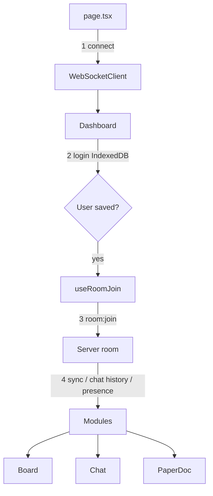

# How this project works (simple guide)

This page explains the realtime workspace in plain language — for anyone joining the codebase for the first time.

---

## The big idea (one sentence)

**One login + one WebSocket pipe + many feature modules** that only listen for their own messages.

Think of the WebSocket like a **shared phone line** into a room:

- You dial once (`connect`)
- You introduce yourself once (`room:join`)
- Board, Chat, and Shared Doc each only care about their own conversations on that same line

---

## Pieces of the app

| Piece | What it does | Main files |
|--------|----------------|------------|
| **Page** | Opens the single WebSocket | `frontend/src/app/page.tsx` |
| **Dashboard** | Login (IndexedDB), join room, layout | `frontend/src/components/Dashboard.tsx` |
| **Board** | Cards / columns / drag-drop | `frontend/src/components/board/Board.tsx` |
| **Chat** | Messages + typing | `frontend/src/components/chat/ChatPanel.tsx` |
| **Paper doc** | Shared textarea | `frontend/src/components/paper/PaperDoc.tsx` |
| **WS client** | Connect, send, `on(event)` | `frontend/src/websocket/client.ts` |
| **Server router** | Reads `type` and routes the message | `server/src/realtime/router.ts` |

---

## Step-by-step: what happens when you open the app

```text
1. Browser loads page.tsx
        │
        ▼
2. Create WebSocketClient → connect to server
   (still anonymous — just a live pipe)
        │
        ▼
3. Dashboard loads
   - If no user → show login form
   - Save name/role in IndexedDB
        │
        ▼
4. When user exists AND socket is connected
   → useRoomJoin() sends ONE message: room:join
        │
        ▼
5. Server puts you in the board room and replies with:
   - sync:state     → columns + cards
   - chat:history   → past messages
   - presence:update → who’s online
        │
        ▼
6. Feature modules are already listening:
   - Board handles card/column events
   - Chat handles chat events
   - PaperDoc handles data:paper
```

### Tiny flowchart



---

## One connection, many listeners

```text
                    ┌─────────────────────────┐
                    │   page.tsx              │
                    │   1 × WebSocketClient   │
                    └───────────┬─────────────┘
                                │
                    ┌───────────▼─────────────┐
                    │   Dashboard             │
                    │   joinRoom (once)       │
                    └───────────┬─────────────┘
               ┌────────────────┼────────────────┐
               ▼                ▼                ▼
           Board.tsx       ChatPanel.tsx     PaperDoc.tsx
        listens for:      listens for:      listens for:
        sync:state        chat:history      data:paper
        card:*            chat:message
        column:*          chat:typing
```

**Rule of thumb:** modules do **not** open their own sockets. They receive the parent `ws` and call:

- `ws.on("some:event", handler)` — listen
- `ws.send({ type: "...", ... })` — talk

---

## Data flow by feature

### 1) Login (no WebSocket yet)

```text
You type name + role
        → save to IndexedDB
        → React state `user` is set
        → now Dashboard can join the room
```

IndexedDB is just **local memory on your browser** so refresh doesn’t forget who you are.

---

### 2) Join room (the handshake)

```text
Client                         Server
  │                              │
  │  room:join { boardId,        │
  │    userId, name, role }      │
  │ ───────────────────────────► │
  │                              │  add you to room
  │  sync:state                  │
  │ ◄─────────────────────────── │
  │  chat:history                │
  │ ◄─────────────────────────── │
  │  presence:update (everyone)  │
  │ ◄─────────────────────────── │
```

After this, you are “in the room.” Chat and card moves will fail with `not_joined` if this step never happened.

---

### 3) Board (cards)

**You create a card**

```text
Board UI
  → optimistic update (show card immediately)
  → ws.send({ type: "card:create", card, updatedBy })
  → server validates + broadcasts card:create
  → other browsers’ Board handlers add the card
```

**You drag a card**

```text
Board UI
  → update local columnId/order
  → ws.send({ type: "card:move", ... })
  → server broadcasts card:move (and/or card:move:ack)
  → other Boards move the same card
```

Board only cares about: `sync:state`, `card:*`, `column:*`.

---

### 4) Chat

**You send a message**

```text
ChatPanel
  → show message locally
  → ws.send({ type: "chat:message", text, ... })
  → server stores + broadcasts chat:message
  → other ChatPanels append it
```

**You type**

```text
ChatPanel
  → ws.send({ type: "chat:typing", isTyping: true/false })
  → others show “X is typing…”
```

Chat only cares about: `chat:history`, `chat:message`, `chat:typing`.

---

### 5) Shared doc (textarea)

```text
PaperDoc
  → onChange → ws.send({ type: "data:paper", paperData })
  → server broadcasts data:paper to the room
  → other PaperDocs set textarea value
  (sender usually ignores their own echo)
```

Also saved in `localStorage` as a simple local backup.

---

## Server side (how messages are sorted)

```text
Browser JSON  →  router.ts looks at `type`

  chat:message / chat:typing     →  chat/handler
  whiteboard:*                   →  whiteboard/handler
  everything else (room:join,
    card:*, data:paper, …)       →  board/handler
```

Then the room manager **broadcasts** to everyone in that `boardId` (except sometimes the sender, depending on the handler).

---

## Message cheat sheet

| Direction | `type` | Meaning |
|-----------|--------|---------|
| Client → Server | `room:join` | Enter the shared room (once) |
| Client → Server | `heartbeat` | “I’m still here” |
| Client → Server | `card:create` / `card:move` / … | Board actions |
| Client → Server | `chat:message` / `chat:typing` | Chat actions |
| Client → Server | `data:paper` | Shared doc text |
| Server → Client | `sync:state` | Full board snapshot |
| Server → Client | `chat:history` | Past chat |
| Server → Client | `presence:update` | Who is online |
| Server → Client | `card:*` / `chat:*` / `data:paper` | Live updates |
| Server → Client | `error` | Something went wrong |

---

## Mental model for new code

Ask yourself:

1. **Do I need a new WebSocket?** → Almost never. Reuse the parent client from `page.tsx`.
2. **Is this a new feature module?** → New component that takes `ws` + user, and only `on`/`send`s its own event types.
3. **Does everyone need the same room?** → Keep using the same `room:join` / `boardId`. Don’t join again from each module.

---

## Quick “follow one click” exercise

1. Open two browser windows on the app.
2. Log in as two different names.
3. Create a card in window A.
4. In DevTools → Network → WS, watch:
   - A sends `card:create`
   - B receives `card:create`
5. Type in chat / the shared doc and watch the same pipe carry different `type` values.

That’s the whole system: **one pipe, typed messages, modules that filter by type.**
